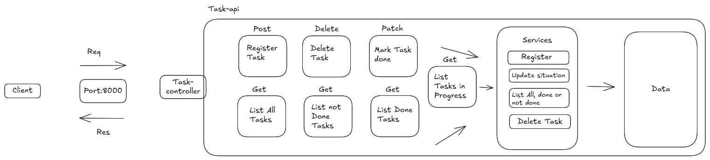

# Task-Tracker

### Uma mini projeto back-end para rastrear suas tarefas diárias.

### Arquitetura do projeto:


### Tecnologias Usadas:


### Instalar projeto

Clonar repositório:
```bash
git clone https://github.com/vicenteprogammer/task-tracker.git
```
Instalar dependências:
```bash
npm i
```
Criar variáveis ambientes:
```bash
PORT=3000
```

Executar todo o código
```bash
npm start
```
### Endpoints

Registrar task:
```
POST -> /register
```

Listar todas as tasks:
```
GET -> /listAll
```

Listar tasks concluídas:
```
GET -> /listdone
```

Atualizar status da task por id:
```
PUT -> /updateStatsTask
```

Deletar tasks:
```
DELETE -> /delete
```


### Projeto finalizado, não foi uma coisa tão complexa, mas consegui relembrar e praticar os estudos de back-end.😅
